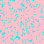

# Conway's Game of Life - Rust + minifb

Este proyecto es una implementación en Rust del famoso **Juego de la Vida de Conway**, utilizando la biblioteca [minifb](https://github.com/emoon/rust_minifb) para gráficos simples basados en framebuffer.

  

##  Reglas de Conway

1. **Cualquier celda viva** con menos de 2 vecinos vivos muere (subpoblación).  
2. **Cualquier celda viva** con 2 o 3 vecinos vivos sobrevive.  
3. **Cualquier celda viva** con más de 3 vecinos vivos muere (sobrepoblación).  
4. **Cualquier celda muerta** con exactamente 3 vecinos vivos cobra vida (reproducción).

##  Características

- Visualización en tiempo real con `minifb`.
- Grid toroidal (los bordes se conectan).
- Inicialización aleatoria del tablero.
- Actualización automática cada 100 ms.
- ESC para salir del programa.

##  Requisitos

- Rust instalado (recomiendo usar `rustup`)
- Cargo (incluido con Rust)
